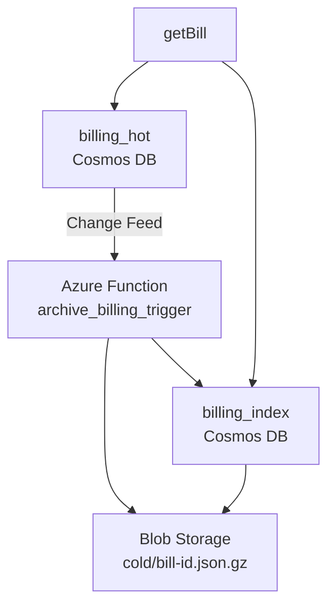

# Azure cost optimization challenge
### Architecture


```
Client ──► API Mgmt ──► FunctionApp
                      │
                      ├─► Cosmos DB (hot, TTL 90d)
                      │        ▲
Change Feed ──────────┘        │
           │                   │
           ▼                   │
Archive Function ──► Blob Storage (Cold, Gzipped JSON)
```


## Overview

This project implements a cost-optimized, serverless billing records system on Azure. It uses Cosmos DB for recent (≤90 days) records and Blob Storage for older (cold) records, with a metadata index for fast retrieval. Records are archived automatically via an Azure Function triggered by the Cosmos DB change feed. The API layer transparently accesses both hot and cold paths without changing existing contracts.

* **Features**

  ```markdown
  - Serverless architecture (Cosmos DB, Azure Function, Blob Storage)
  - Automatic archival of older records (≥90 days)
  - Transparent read access to cold data
  - Minimal metadata index for cost efficiency
  - Fully compliant with latency, data retention, and zero-downtime requirements
  ```

* **Tech Stack**

  ```markdown
  - Azure Cosmos DB (SQL API)
  - Azure Blob Storage (cool tier)
  - Azure Functions (Python)
  - TypeScript for data-access layer
  - Bash for infrastructure provisioning
  ```

## Directory Structure

```bash
infra/
  ├─ create_resources.sh          # Sets up Cosmos, Blob, indexing
  └─ index-off.json              # Disables full indexing for metadata container
function/archive_billing_trigger/
  ├─ __init__.py                  # Archival logic via change feed
  ├─ function.json                # Function binding definition
  └─ local.settings.sample.json  # Env var template
src/
  └─ getBill.ts                   # Unified API read logic (hot + cold)
```

## References

* [ChatGPT Chat](https://chatgpt.com/share/68510e55-3510-8010-9938-6a98d4aec8d3)
* [Cosmos DB](https://azure.microsoft.com/en-us/services/cosmos-db/)
* [Azure Functions](https://azure.microsoft.com/en-us/services/functions/)
* [Azure Blob Storage](https://azure.microsoft.com/en-us/services/storage/blobs/)
