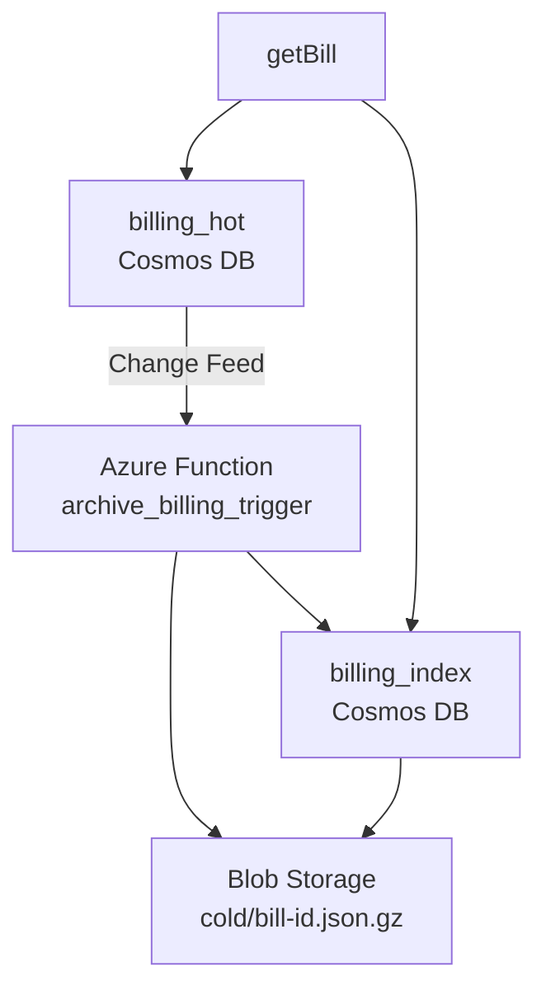

# Billing Data Archival Architecture




```
Client ──► API Mgmt ──► FunctionApp
                      │
                      ├─► Cosmos DB (hot, TTL 90d)
                      │        ▲
Change Feed ──────────┘        │
           │                   │
           ▼                   │
Archive Function ──► Blob Storage (cold, Parquet)
```

## Directory Structure

- infra/
  - create_resources.sh
  - index-off.json
- function/archive_billing_trigger/
  - __init__.py
  - function.json
  - local.settings.sample.json
- src/
  - getBill.ts
